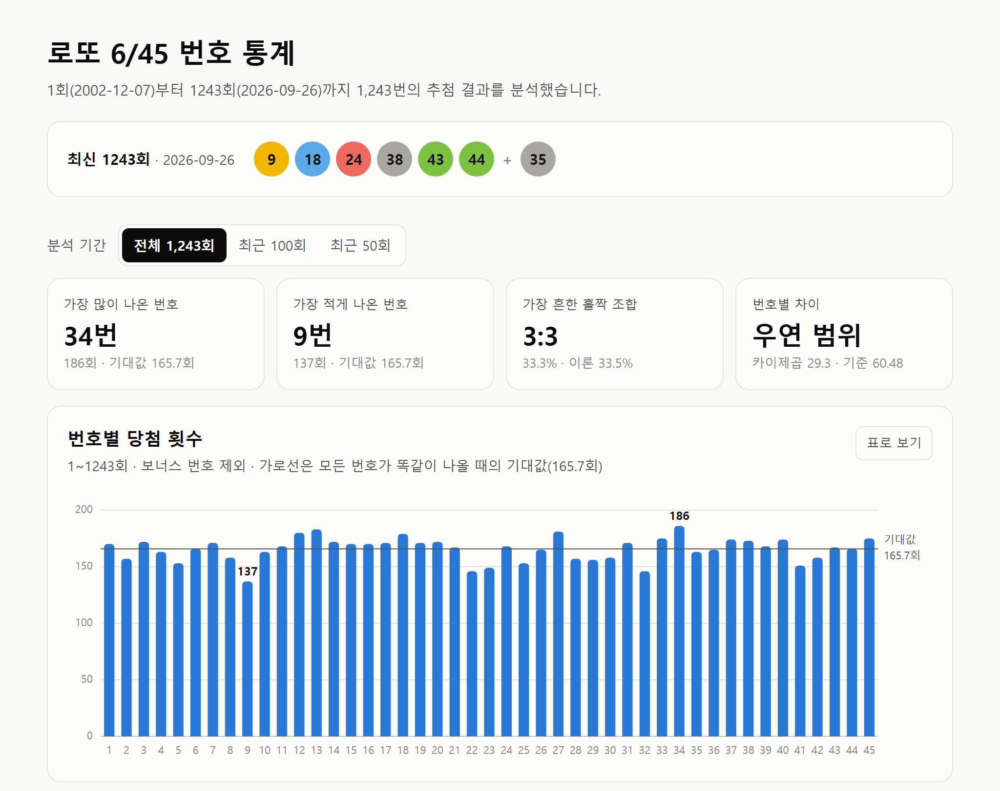
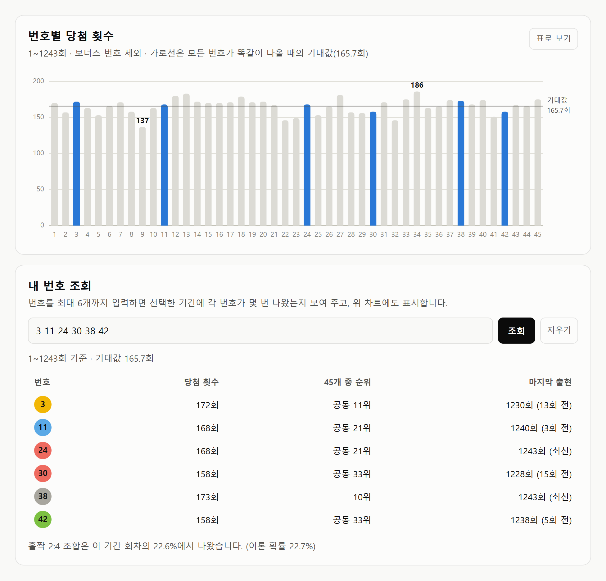
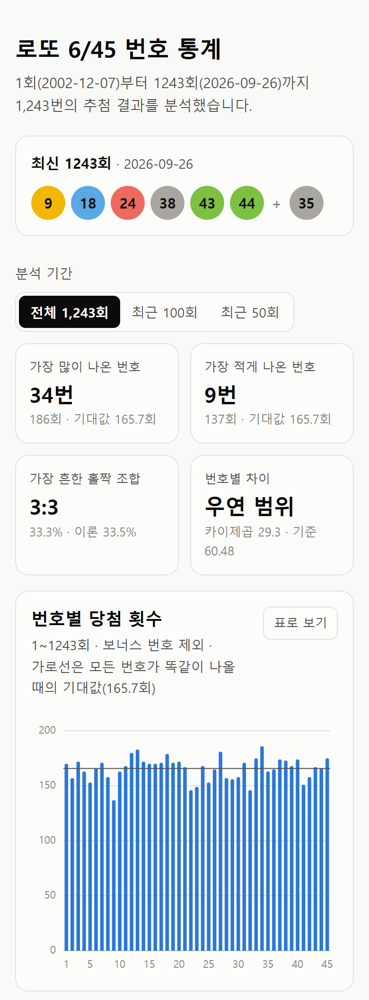
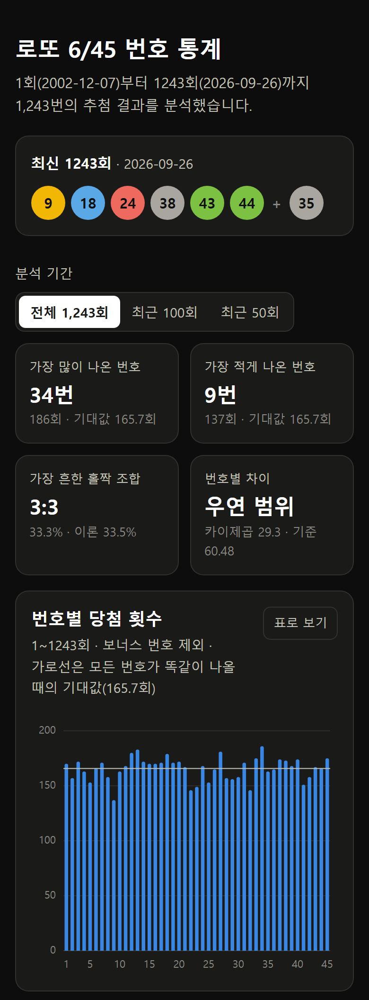
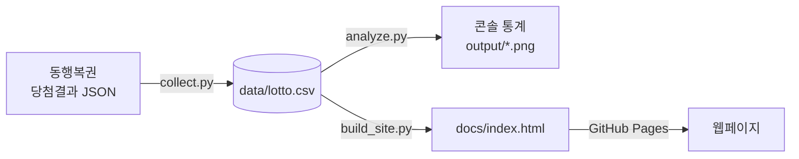
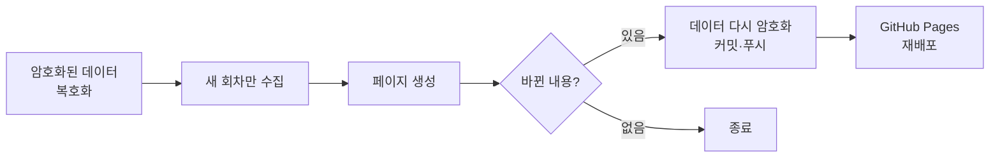

# 로또 6/45 번호 통계

동행복권 로또 6/45의 1회부터 최신 회차까지 당첨번호를 수집해 번호별 출현 빈도와 홀짝 비율을 분석하고,
그 결과를 웹페이지로 보여주는 크롤링 학습 프로젝트입니다. 매주 GitHub Actions가 새 회차를 자동으로 반영합니다.

**웹페이지: [pcw7.github.io/lotto-stats](https://pcw7.github.io/lotto-stats/)**

<picture>
  <source media="(prefers-color-scheme: dark)" srcset="screenshots/page-dark.png">
  
</picture>

<sub>화면은 1243회 기준입니다. 최신 결과는 웹페이지에서 볼 수 있습니다.</sub>

## 웹페이지 기능

- **분석 기간 선택**: 전체, 최근 100회, 최근 50회 중에서 고르면 아래 통계가 모두 그 기간 기준으로 바뀝니다.
- **번호별 당첨 횟수**: 1~45번의 당첨 횟수를 기대값 기준선과 함께 보여줍니다. 막대에 마우스를 올리면 횟수가 나오고, 표로도 볼 수 있습니다.
- **홀짝 조합**: 회차별 홀수·짝수 조합의 실제 비율을 이론 확률(초기하분포)과 비교합니다.
- **내 번호 조회**: 번호를 입력하면 번호별 당첨 횟수, 순위, 마지막 출현 회차를 보여주고 차트에서 강조합니다.
- **오래 안 나온 번호**: 최신 회차 기준으로 가장 오래 나오지 않은 번호 5개를 보여줍니다.
- 다크 모드와 모바일 화면을 지원합니다.



<table>
  <tr>
    <td align="center"></td>
    <td align="center"></td>
  </tr>
  <tr>
    <td align="center">모바일</td>
    <td align="center">모바일 다크 모드</td>
  </tr>
</table>

## 분석 결과 (1~1243회 기준)

| 항목 | 결과 |
|---|---|
| 가장 많이 나온 번호 | 34번 (186회) |
| 가장 적게 나온 번호 | 9번 (137회) |
| 번호당 기대값 | 165.7회 |
| 카이제곱 검정 | 29.3 (자유도 44, 유의수준 5%의 기준값 60.48보다 작음) |
| 가장 흔한 홀짝 조합 | 3:3 (33.3%, 이론 확률 33.5%) |

가장 많이 나온 번호와 가장 적게 나온 번호는 49회 차이가 나서 커 보이지만, 카이제곱 검정으로 보면 무작위 추첨에서 자연스럽게 생기는 정도의 차이입니다.
홀짝 조합 비율도 이론 확률과 거의 같습니다. 매 회차 추첨은 이전 결과와 상관없이 독립적이므로, 과거 출현 빈도로 다음 당첨번호를 예측할 수는 없습니다.

## 동작 방식



매주 일요일 09:17(한국 시간)에는 GitHub Actions가 같은 과정을 자동으로 실행합니다.



## 직접 실행

```bash
pip install -r requirements.txt
python collect.py      # 당첨번호 수집 → data/lotto.csv (이미 받은 회차는 건너뜀)
python analyze.py      # 분석 결과 출력 + 차트 → output/
python build_site.py   # 웹페이지 생성 → docs/index.html
```

## 자동 갱신

워크플로는 [`.github/workflows/update-lotto.yml`](.github/workflows/update-lotto.yml)에 있습니다.
레포의 **Actions 탭 → 로또 통계 갱신 → Run workflow**로 바로 실행할 수도 있습니다.

- 동행복권은 해외 IP(GitHub 서버)의 연속 요청을 막습니다. 그래서 지난 데이터를 암호화한 `lotto.csv.enc`를 레포에 보관하고, Actions는 이를 복호화한 뒤 새 회차만 받습니다. (요청 1~2번)
- 암호 키는 레포 Settings → Secrets의 `LOTTO_DATA_KEY`에 있습니다. 원본 데이터는 공개되지 않습니다.
- Actions가 커밋을 추가하므로, 로컬에서 작업하기 전에 `git pull`을 먼저 하세요. `docs/`와 `lotto.csv.enc`는 Actions가 관리하므로 로컬에서 커밋하지 않습니다.
- 키를 바꾸거나 잃어버렸다면, 로컬에서 `collect.py`로 데이터를 최신으로 맞춘 뒤 새 키를 만들어 `LOTTO_DATA_KEY` 환경 변수로 `python data_crypt.py encrypt`를 실행하고, 같은 키를 `gh secret set LOTTO_DATA_KEY`로 등록한 다음 `lotto.csv.enc`를 커밋하세요.

## 파일 구조

| 파일 | 내용 |
|---|---|
| `collect.py` | 동행복권에서 당첨번호를 수집해 CSV로 저장 |
| `analyze.py` | 번호별 빈도, 홀짝 비율, 오래 안 나온 번호를 분석하고 차트(`output/*.png`) 생성 |
| `build_site.py` | 기간별(전체, 최근 100회, 최근 50회) 집계 결과를 `site_template.html`에 넣어 웹페이지(`docs/index.html`) 생성. 원본 데이터는 넣지 않습니다 |
| `site_template.html` | 웹페이지 틀 (HTML, CSS, 자바스크립트 차트) |
| `data_crypt.py` | 수집 데이터를 암호화·복호화 (자동 갱신용) |
| `lotto.csv.enc` | 암호화된 수집 데이터. 키가 없으면 읽을 수 없습니다 |
| `data/lotto.csv` | 수집한 데이터 (회차, 추첨일, 번호 6개, 보너스, 1등 당첨자 수·당첨금, 총판매금액). 레포에는 포함하지 않습니다 |
| `docs/` | GitHub Pages로 공개되는 웹페이지 |
| `screenshots/` | README용 웹페이지 화면 |

## 기술 스택

- **수집·분석**: Python, requests, pandas, matplotlib
- **웹페이지**: HTML, CSS, 자바스크립트 (SVG로 직접 그린 차트, 외부 라이브러리 없음)
- **자동화·배포**: GitHub Actions, GitHub Pages, cryptography (데이터 암호화)

## 데이터 출처와 수집 원칙

- 동행복권 당첨결과 페이지(`/lt645/result`)가 화면을 그릴 때 내부적으로 호출하는 JSON 주소(`/lt645/selectPstLt645InfoNew.do`)를 사용합니다.
- robots.txt에서 차단하는 경로는 `/resources/`, `/winImages/`뿐입니다. (2026-10-02 확인)
- 요청 사이에 1초씩 쉬어 서버 부담을 줄이고, 자동 갱신 때는 새 회차만 요청합니다.
- 원본 당첨번호 데이터는 공개하지 않고, 웹페이지에는 집계 결과만 넣습니다.
- 동행복권과 관련 없는 개인 학습 프로젝트이며, 당첨번호 예측이나 복권 구매 권유를 위한 것이 아닙니다.
