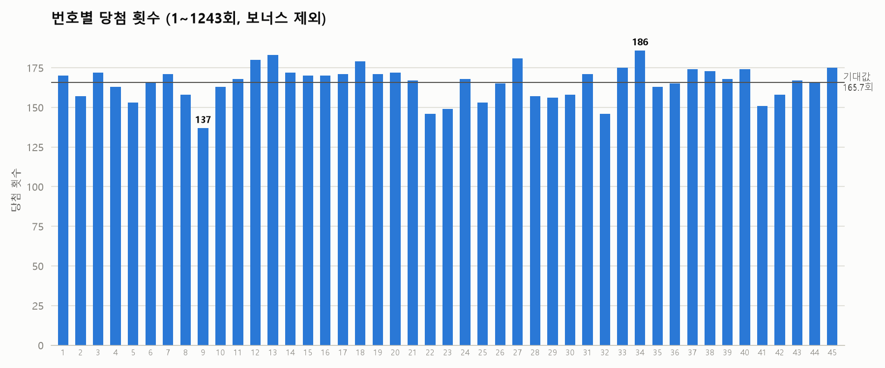
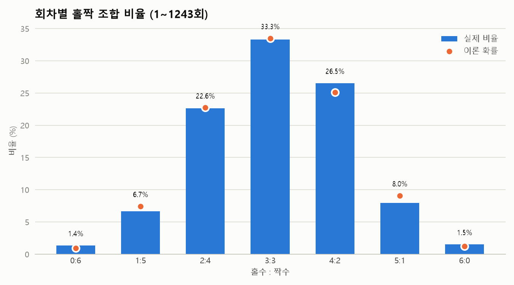

# 로또 6/45 당첨번호 분석

동행복권 사이트에서 1회차부터 최신 회차까지 당첨번호를 수집하고,
번호별 출현 빈도와 홀짝 비율을 분석합니다.

**웹페이지: https://pcw7.github.io/crawling/lotto/**

## 실행

```bash
pip install -r requirements.txt
python collect.py      # 당첨번호 수집 → data/lotto.csv
python analyze.py      # 분석 결과 출력 + 차트 → output/
python build_site.py   # 웹페이지 생성 → ../docs/lotto/index.html
```

`collect.py`는 이미 저장된 회차를 건너뛰고 새 회차만 받아 옵니다.

## 자동 갱신

GitHub Actions([`.github/workflows/update-lotto.yml`](../.github/workflows/update-lotto.yml))가 매주 일요일 09:17(한국 시간)에
새 회차를 수집하고, 새 회차가 있으면 웹페이지를 갱신해서 커밋·푸시합니다.
레포의 **Actions 탭 → 로또 통계 갱신 → Run workflow**로 바로 실행할 수도 있습니다.

- 동행복권은 해외 IP(GitHub 서버)의 연속 요청을 막습니다. 그래서 지난 데이터를 암호화한 `lotto.csv.enc`를 레포에 보관하고, Actions는 이를 복호화한 뒤 새 회차만 받습니다. (요청 1~2번)
- 암호 키는 레포 Settings → Secrets의 `LOTTO_DATA_KEY`에 있습니다. 원본 데이터는 공개되지 않습니다.
- Actions가 커밋을 추가하므로, 로컬에서 작업하기 전에 `git pull`을 먼저 하세요.
- 키를 바꾸거나 잃어버렸다면, 로컬에서 `collect.py`로 데이터를 최신으로 맞춘 뒤 새 키를 만들어 `LOTTO_DATA_KEY` 환경 변수로 `python data_crypt.py encrypt`를 실행하고, 같은 키를 `gh secret set LOTTO_DATA_KEY`로 등록한 다음 `lotto.csv.enc`를 커밋하세요.

아래 차트 이미지는 자동 갱신되지 않는 1243회 기준 스냅샷입니다. 최신 결과는 웹페이지에서 볼 수 있습니다.

## 결과 (1~1243회 기준)



- 가장 많이 나온 번호는 34번(186회), 가장 적게 나온 번호는 9번(137회)입니다. 기대값은 165.7회입니다.
- 카이제곱 값은 29.3으로 기준값 60.48(자유도 44, 유의수준 5%)보다 작습니다. 번호별 차이는 우연으로 설명되는 수준입니다.



- 가장 흔한 조합은 홀짝 3:3(33.3%)이며, 각 조합의 비율이 이론 확률(초기하분포)과 거의 같습니다.

## 파일

| 파일 | 내용 |
|---|---|
| `collect.py` | 동행복권에서 당첨번호를 수집해 CSV로 저장 |
| `analyze.py` | 번호별 빈도, 홀짝 비율, 오래 안 나온 번호 분석 및 차트 생성 |
| `build_site.py` | 기간별(전체, 최근 100회, 최근 50회) 집계 결과를 `site_template.html`에 넣어 웹페이지 생성. 원본 데이터는 넣지 않습니다 |
| `site_template.html` | 웹페이지 틀 (HTML, CSS, 자바스크립트 차트) |
| `data_crypt.py` | 수집 데이터를 암호화·복호화 (자동 갱신용) |
| `lotto.csv.enc` | 암호화된 수집 데이터. 키가 없으면 읽을 수 없습니다 |
| `data/lotto.csv` | 수집한 데이터 (회차, 추첨일, 번호 6개, 보너스, 1등 당첨자 수·당첨금, 총판매금액). 레포에는 포함하지 않으며 `collect.py`를 실행하면 생성됩니다 |
| `output/*.png` | 분석 차트 |

## 데이터 출처

동행복권 당첨결과 페이지(`/lt645/result`)가 화면을 그릴 때 내부적으로 호출하는
JSON 주소(`/lt645/selectPstLt645InfoNew.do`)를 사용합니다.

- robots.txt에서 차단하는 경로는 `/resources/`, `/winImages/`뿐입니다. (2026-10-02 확인)
- 서버 부담을 줄이려고 요청 사이에 1초씩 쉽니다.
- 사이트가 개편되면 주소나 응답 형식이 바뀔 수 있습니다.
